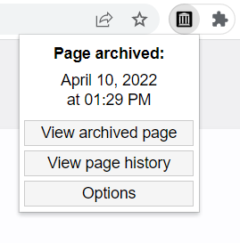

# Wayback Archive Check

Browser extension for checking if a page is in Internet Archive's [Wayback Machine](https://web.archive.org).

## Download

## Dependencies
- [Spacetime - JavaScript timezone library (v7.7.0)](https://github.com/spencermountain/spacetime)
- [psl - JavaScript domain name parser (v1.15.0)](https://github.com/lupomontero/psl)

## License

Code in this repository is licensed under the GNU General Public License Version 3. Details can be found in the [LICENSE](LICENSE) file. 

## Disclaimer

This is an unofficial extension and is not sponsored, owned, or endorsed by the [Internet Archive](https://archive.org).
